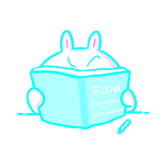
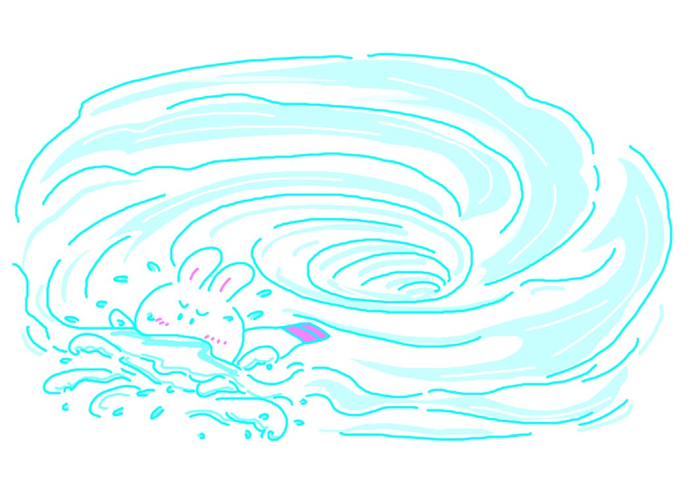
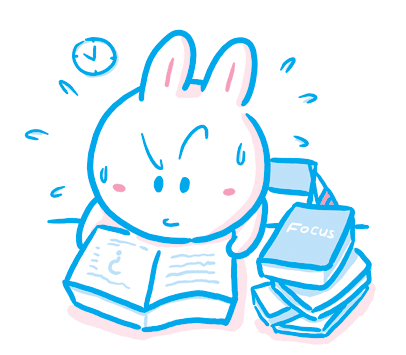
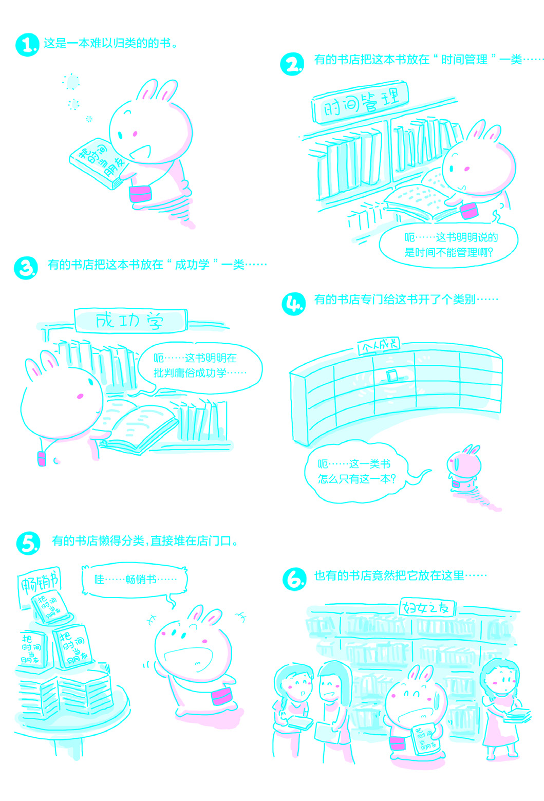

# 第〇章: 困境

##1. 问题

或许因为考试临近，或许因为工作需要，你现在必须把一本书读完。这本书的内容不是轻松的文字，所以不能一目十行——它需要你认真阅读并理解，甚至可能要求你根据它所陈述的原理或者规则进一步创造一些什么，才算真正“有所收获”。

经过一番挣扎，你终于决定“正式开始”！你坐到喜欢的沙发上，打开常听的音乐，翻开书的某一页开始看。

过了一会儿，你突然觉得自己非常渴，想要找水喝。你打开冰箱顺手拿出一瓶饮料，倒进杯子。刚喝了一口，你一下子想起来：不对，不应该喝这种含糖的饮料！真是的，无论说多少次，妈妈都不会记得把含糖的饮料和不含糖的饮料分开放！于是，你跑到妈妈的卧室，与她“理论”了一番，最终发现于事无补，只好一个人悻悻地回来整理冰箱。

你重新回到沙发上，接着看你的书。看了一会儿，你换了个姿势。不巧压到了电视遥控器，电视一下子亮了。这位节目主持人恰好是你最喜欢的。哇，今天她这身打扮真漂亮！不过今天的话题怎么这么无聊？！你还是不由自主地看了一会儿，又顺手用遥控器翻了翻其他频道……幸亏这时一连几个频道都没有好节目，你才停下来，有点失望地想：现在的节目真的很无聊，还不如看书呢！

嗯？怎么这么渴？你这才想起来，整理冰箱前，你把那杯含糖的饮料放在了妈妈的桌子上，却忘了重新给自己倒一杯不含糖的饮料，就直接回到了沙发上。于是你再次起身去弄喝的。喝了两口，你突然想起来你现在正喝的饮料是你最喜欢的——第一次约会的时候，你喝的就是这种饮料……

手机响了，是一条短信。一个朋友问：“你在干嘛？”你没好意思说你在学习，只是含混地说，你病了，在家休息，不想出去……结果朋友竟然打电话过来慰问，你只好支支吾吾地应付了一阵子。

挂了电话，你又回到沙发上。想了想，还是换一下背景音乐吧，现在这首听上去太伤感。于是你扭身摆弄了一会儿音乐播放器，然后重新坐好开始看书。

过了好一阵子，你突然意识到自己刚刚在发呆。打了个寒颤，你下意识地看了一下表——天哪！已经过去两个小时了，可是你连一页书都没看完！

以上的描述，说的肯定不是你，但那场景你一定很熟悉。

终于，在某一刻，你失声惊呼：“没时间了！”

这尴尬，无论是谁，要么已然经历，要么将会经历，没有例外。这尴尬一旦出现，必然压力无比巨大，而且来自四面八方。这种巨大的压力所造成的恐慌，往往可以使当事人做出荒诞不经、让其他人匪夷所思的决定：自相矛盾、自我欺骗、孤注一掷、痴心妄想……诸如此类，不一而足。

完成任何任务都需要一定的时间。同时，任何任务都最好或必须在某个特定的时间点之前完成，即，任务都有一个最后期限。而且，只要是必须完成的任务，不管是否已经开始执行，最后期限就在不断迫近，因为时间永不停歇。

>> “最后期限”在英文中对应的是“deadline”，一个特别生动形象的词：届时未完成者死！

问题好像很简单，看起来无非有以下几种情况。

* 没有按时开始执行任务。
* 错误估算完成任务所需时间。
* 在任务的执行过程中出现了差错。

果真如此的话，那么解决方案好像也很简单。

* 按时开始执行任务。
* 正确估算完成任务所需时间。
* 在执行任务的过程中不要出差错。

可事实上问题并非如此简单，否则也不会让那么多人一 生都束手无策。

##2. 慌乱

我教过很多学生。他们中的绝大多数都一样，压力刻在额头，匆忙写在脸上。他们身上充满了矛盾——他们“**既勤奋又懒惰**”。

>> 除了讲课，我还经常要到全国各大高校做讲座，因此每年在我面前流动的学生人数保守估计超过两万。

他们很勤奋，每到周末都要起个大早，在上午八点半之前挤公共汽车赶来上课，中午要吃既不价廉又不味美的盒饭，下午要在一个充满各种味道的教室里继续上课。他们也许会玩电子游戏，但显然比那些只玩电子游戏的人更勤奋；他们也许会喝酒打牌，但显然比那些只喝酒打牌的人更努力。

可与此同时，他们也随时展露懒惰的倾向。我教得最好的课程是作文。我很少在课堂上讲语法、词汇、修辞之类的东西，因为这些内容学生可以自学或者很容易自学。我更喜欢讲思维方法，我认为这才是教学的关键所在。只有想清楚了，才有可能写清楚。想不清楚，甚至连写出来的必要都没有。讲作文课也是我最开心的事情之一，因为作文课实际上是思考课。自己思考原本就是件很快乐的事情，而教别人思考则是学习思考、锻炼思维的最好方法。我的学生也很开心，因为他们听懂了我对他们说的话：“只有学会正确地思考，才意味着真正进化成人。”

没有人愿意做猴子。

终于，有一天，我还是被一名学生“打败”了。

那天下课之后，一个男孩捧着我写的那本非常畅销的《TOEFL  iBT 高分作文》让我给他签名。我签了。然后他说：“老师，我可不可以问你一个问题？”我笑着说：“你现在可以直接问第二个了。”他说：“老师，你说，如果我把你这本书里的作文全都背下来，在考场上默写一篇，会不会被判雷同呢？”当时我一下子失去了耐心，尽管没有发火，但语气里肯定有一些东西：“那你说呢？！”那个男孩脸红了一下，迅速走了。

我快被他弄疯了。难道我的课讲得这么没有效果吗？我上课时那么卖力地对他们讲道理：“作文，当然要自己写；就算有范文，也是用来参考的。”而且我很确定，我在《TOEFL iBT 高分作文》的前言里花费了很多笔墨去讲解如何参考范文而不是照抄范文。抄袭别人的文章当然会被判为雷同——这还用问吗？！结果怎么会是这样？

可是，竟然决心背下这本书里所有185篇文章的学生，又怎么可能是懒惰的呢？

更要命的是，不止一个学生曾经这样问，所以这肯定不是个案。

经过反复询问，认真观察，我终于明白了——很多学生“既勤奋又懒惰”的怪异现象来自他们对“时间压力”的感受。“没时间了”或者“时间不够了”的恐慌，使他们超乎寻常地勤奋。哪怕只是虚假的“勤奋”，一样能让他们恨不得废寝忘食。而同样的感受，也使他们终日不忘寻找捷径，美其名曰“提高效率”，而实际上却想着“最好不费吹灰之力”。无论哪一种行为，都肯定是不现实的，因为已经“没时间了”——这才是冷冰冰的事实。

“没时间了”，是“时间恐慌症”患者脑子里唯一反复闪现的一句话。巨大的压力，极度的恐慌，使“患者”身上综合了一切矛盾：他们既勤奋又懒惰，既聪明又愚蠢，既勇敢又懦弱，既满怀希望又分分秒秒面临绝望，既充满自信又随时随地体会自卑……

“没时间了”，其可怕程度几乎无异于死亡。死亡是所有人都要面临的终极困境——没有解决方案的困境。对其恐惧之甚，以至人类不分种群，不约而同地集体创造出一个天堂留给自己和自己喜爱的同类，同时还创造出一个地狱送给自己憎恨的同类。但这毕竟不是切实有效的解决方案。死亡本身其实并不可怕，面临死亡的过程才真正可怕。如此，就能很容易地体会那些“既勤奋又懒惰”的学生，面临的是怎样的悲惨境遇了。

但是，生活中明显有另外一些人——尽管数量上并不占优——在用另外一种状态生活。他们从容，他们优雅，他们善于化解各种压力，安静地去做他们认为应该做的事情，并总能有所成就。他们甚至可以达到常人无法想象的境界——不以物喜，不以己悲。面对同样的困境，这另外的一些人究竟是如何保持从容的呢？

##3. 解决

你想打开一扇门，可那门上有个锁，把门锁住了。“如果能找到钥匙就好了”，你想。可是钥匙在哪里呢？反正不在那把锁上。既然门被锁上了，钥匙就一定不会插在锁孔里。

“没时间了！”这种尴尬就像是一把我们想要打开的锁。

同样，要想摆脱这种尴尬，死盯着这把锁是没有用的。

很少有人会注意，所谓“管理时间”抑或“时间管理”是虚假的概念，是不可能完成的任务。时间不会服从任何人的管理，它只会自顾自地流逝。你不可能冲它大喊：“时间，你给我慢一点！”它只是自顾自地流逝。你也不可能向它大叫：“时间，你给我快一点！”它还是自顾自地流逝。时间不理任何人，它用自己特有的速度流逝，不受任何外界因素影响。

——毫无疑问，我们无法管理时间。

>> 爱因斯坦提出相对论之后，“绝对时空观”已被打破，所以纯粹从理论出发的话，“时间不受任何外界因素影响”并不完全准确。但是，对于我们每个正在现实中生活的人来说，我们的时间依然是绝对的。爱因斯坦的理论并不适用于我们正在讨论的话题。

钥匙在其他地方，反正不在锁上。尝试着从“管理时间”开始解决问题，注定徒劳。尽管我们面临的尴尬是“没时间了”，可从本质上来看，这尴尬与时间的关系不是很大。没错，**问题出在我们自己身上。**

你可能听说过这个原则：
 
> 先把任务分为“重要的”和“不重要的”，再把任务分为“紧急的”和“不紧急的”，然后挑选“重要的”而又“紧急的”的任务优先执行……

> （此原则出自史蒂芬·柯维（Stephen  Covey）的《要事第一》（*First Thing First*，1994）。中国读者可能更熟悉他的另一本书：《高效能人士的七个习惯》（*Seven Habits of Highly Effective People*，1989）。）

看起来似乎很有道理，而实际的操作效果怎么样呢？并不好。为什么？因为你发现（或最终证明）自己没有足够的能力去区分一项任务是否重要、是否紧急。所以，到头来，尽管别人告诉你的方法是对的，可是你操作起来却得不到期望的结果。

没错，问题出在我们自己身上。

我们无法管理时间。**我们真正能够管理的，是我们自己**。只有接受这个简单的事实，才有解决问题的希望。“时间不可管理”，尽管听上去很简单，但是理解它，进而接受它，可不见得那么容易。因为，它未必是（甚至几乎肯定不是）你以往已经认同的观念。

**人们很难接受与已有知识和经验相左的信息或观念**，因为一个人已有的知识和观念都是经历过反复筛选的。尽管很多知识和观念是被灌输的，但知识的持有者对“被灌输”这一事实往往毫无察觉，就算察觉，也可能拒绝承认。人们更愿意相信自己拥有一定的判断能力，不会被轻易糊弄。即使是一些“想当然”的观念，人们也倾向于认为那是“思考过后的结论”。在历史上，这种情况反复出现。例如，在葡萄牙航海家麦哲伦证明“地球是圆的”之前，大多数人相信大地是平的，并且把这种想当然得到的结论当作自己认真思考之后才获得的知识。以至在其被证明有误的那一瞬间，第一 个念头不是“啊？原来是这样！”而是“扯淡！没那回事儿！”

>> 公元前5世纪左右，古希腊哲学家毕达哥拉斯提出地球的形状是球形，但他并没有什么科学依据；之后古希腊哲学家亚里士多德根据月食出现时地影是圆形，提出地球是球形，这才算是第一个科学证据；1622年，葡萄牙航海家麦哲伦完成环球航行，人们才开始普遍接受地球是球形的这一事实。另，在“大地是平的”被证伪之前，没有“地球”这个概念。

被灌输的观念，越是错的，越有惊人的繁殖能力。随着时间的推移，它愈发顽固，直到最后，它能在不知不觉之间 蒙蔽一个人，使其失去心智成长能力。

有一个普遍存在而又令人惊讶的例子：很多人相信没有生出儿子是女人的错——即使是在今天。中学《生物》课本里讲得很清楚：女性卵子里的性染色体是XX，而男性精子里的性染色体是XY，精子与卵子结合时会出现可能性相当的两种情况，即XX和XY。所以，生出来的孩子是男是女，是概率相同的随机事件，与女性没有关系。科学事实简单明了，而结果显而易见：不是每一个读过书的人都能理解并接受这个简 单易懂的科学事实。

>> 生男生女这个问题，要非得说跟谁有关系，也只能与男性有关系：因为Y染色体来自男性——可即使如此，也不会改变此事件的概率。

>> 坊间有一种所谓“酸性体质”理论，声称母体酸碱度会影响染色体的结合，进而宣扬用某些方法可以控制胚胎的性别。这种说法毫无科学根据，却信之者众。

本书此后的不少内容，很可能与读者最初的期望不符，甚至相左。其实，这本书的主旨非常简单：时间是不可能被管理的。必须开启心智，看清楚，想明白：问题出在我们自 己身上。而我们所面临的问题，与时间、管理或时间管理都没有多大的关系。解决方案只有一个，那就是“一切都靠积累”。深信积累的力量，时间就是你的朋友，否则，它就是你的敌人。

##花絮： 

本书主张“时间不可管理”，这使书店在销售它的时候颇为尴尬。想想看，这本书放在哪个类别里好呢？放在“时间管理”类别里，显然不合适——因为本书的主旨明明是“时间不可管理”。放在“成功励志”里呢？也不合适，因为本书中有整整一章专门批评庸俗成功学。有的网上书店为这本书专门开辟了一个类别——个人成长，这个类别里只有一本书——《把时间当作朋友》。有的书店懒得操心，随便把这本书放在一个地方——有读者来信告诉我说他在“妇女之友”类别里看到了这本书。当然，更多的书店想出了一个很好的方法——不分类了——反正畅销，直接堆在店门口……

